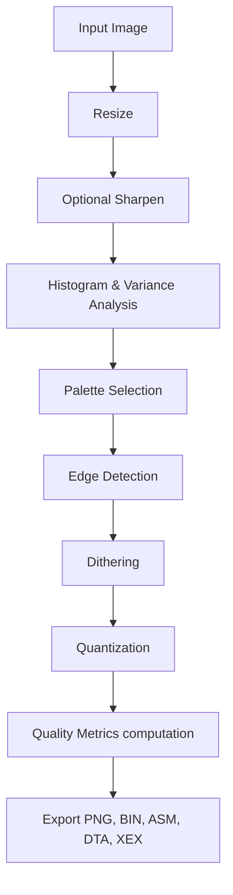

# Atari Image Converter

A high-quality image converter to translate modern formats (PNG, JPG, BMP, GIF) into Atari 8-bit graphics (specifically targeting **ANTIC Mode E**).

This project is designed from the ground up as a highly modular, professional-grade image processing pipeline. It aims to surpass standard quantization/dithering utilities (like Pillow, ImageMagick, GIMP, or pngquant) for retro computing purposes by incorporating specialized perception-driven quantization, local variance analysis, and adaptive dithering.

---

## Features

- **Input Support:** PNG, JPG, BMP, and GIF.
- **Target Mode:** ANTIC Mode E (160×192, 2 bits per pixel, 4 colors including background).
- **Extensible Pipeline:** Fully decoupled stages for loading, resizing, sharpening, histogram/variance analysis, palette selection, edge detection, dithering, quantization, metrics computation, and exports.
- **Adaptive Dithering:** Analyzes local image detail, variance, and edges to choose the optimal dithering method per-pixel (e.g., using ordered dither on smooth gradients, error diffusion on detailed areas, and disabling dither on sharp edges to avoid color bleeding).
- **Quality Metrics:** Built-in calculation of MSE, PSNR, SSIM, RGB/Luminance errors, and histogram coverage.
- **Visual Previews:** Generates side-by-side comparisons, upscale previews (2x, 4x), and pixel-level error heatmaps.

---

## Installation

Ensure you have Python 3.12+ installed. Clone this repository, navigate to the directory, and install in editable mode with development dependencies:

```bash
python -m pip install -e ".[dev]"
```

This installs dependencies such as `numpy`, `Pillow`, `pytest`, and `ruff`.

---

## Usage

You can run the tool using the CLI wrapper [convert.py](file:///c:/Users/grzes/Documents/Projects/py-image-converter/convert.py).

### Basic Conversion
Convert an image to a raw Atari `.bin` file (which is the default format):
```bash
python convert.py input.png output.bin
```

### Specifying Export Formats
The output format can be automatically inferred from the extension of your output file. You can also explicitly request multiple formats using the `--export` option:
```bash
python convert.py input.png output --export png bin xex asm dta
```

Supported export formats:
- **`png`**: Reconstructed visual image mapped to the Atari palette.
- **`bin`**: Raw ANTIC Mode E screen data.
- **`asm`** / **`s`**: Assembler directives containing raw bytes.
- **`dta`**: Raw data output format.
- **`xex`**: Executable Atari program file.

### CLI Parameters

| Option | Choices / Format | Default | Description |
| :--- | :--- | :--- | :--- |
| `input` | Path | (Required) | Path to input image (PNG/BMP/GIF/JPG). |
| `output` | Path | (Required) | Base output path. |
| `--width` | Integer | `160` | Output width. |
| `--height` | Integer | `192` | Output height. |
| `--mode` | `ANTIC_E` | `ANTIC_E` | Atari hardware display mode. |
| `--palette` | `popularity`, `kmeans`, `median_cut`, `octree`, `perceptual` | `popularity` | Algorithm used to select the 4-color Atari palette. |
| `--colors` | Integer | `4` | Number of output colors. |
| `--dither` | `none`, `floyd`, `jarvis`, `stucki`, `sierra`, `sierra_lite`, `burkes`, `atkinson`, `bayer2`, `bayer4`, `bayer8`, `adaptive` | `floyd` | Dithering algorithm. |
| `--quantizer` | `nearest`, `perceptual`, `weighted`, `adaptive` | `nearest` | Color matching and quantization method. |
| `--resize` | `nearest`, `bilinear`, `bicubic`, `lanczos` | `lanczos` | Image resizing algorithm. |
| `--sharpen` | Flag | `False` | Apply an unsharp mask post-resize. |
| `--sharpen-strength` | Float | `1.0` | Strength of the sharpening effect. |
| `--background-index` | Integer (`0-255`) | `0` | Default Atari color index for the background. |
| `--preview` | Flag | `False` | Generate high-res comparison, upscaled, and error heatmap previews. |
| `--metrics` | Flag | `False` | Compute and display quality metrics. |
| `--config` | Path | None | Path to a JSON configuration file to load settings. |
| `--save-config` | Path | None | Path to save current pipeline settings as a JSON config file. |

---

## Configuration via JSON

Instead of passing extensive command line arguments, you can save and load pipeline settings from a JSON file.

### Loading Configuration
```bash
python convert.py input.png output.xex --config my_config.json
```

### Saving Current CLI Flags to JSON
```bash
python convert.py input.png output.bin --save-config my_config.json --dither adaptive --palette kmeans --preview
```

### Example Config JSON File
```json
{
    "mode": "ANTIC_E",
    "width": 160,
    "height": 192,
    "palette": "kmeans",
    "colors": 4,
    "dither": "adaptive",
    "quantizer": "nearest",
    "resize": "lanczos",
    "sharpen": true,
    "sharpen_strength": 1.2,
    "background_index": 0,
    "preview": true,
    "metrics": true,
    "export": [
        "png",
        "bin",
        "xex"
    ]
}
```

---

## Visual Previews & Heatmaps

If you run with `--preview`, the converter generates a dedicated directory `<output>_preview/` containing:
- `<output>_x2.png` & `<output>_x4.png`: Upscaled renders using nearest-neighbor scaling (preserving retro pixel boundaries).
- `<output>_compare.png`: Side-by-side comparison of the source (resized) image and the Atari conversion.
- `<output>_error.png`: Per-pixel color representation difference heatmap (red indicates high conversion discrepancy, blue indicates low error).

---

## Batch Generation Script (PowerShell)

For generating many conversion variants at once (all palette + dither + resize + quantizer combinations), use `generate-images.ps1`.

### Required Parameters

- `-InputFile`: Input image path.
- `-OutputDir`: Output directory for generated images.
- `-Height`: Output height passed to CLI as `--height`.
- `-Width`: Output width passed to CLI as `--width`.

### Example

```powershell
Set-ExecutionPolicy -Scope Process Bypass
.\generate-images.ps1 -InputFile "C:\temp\image.png" -OutputDir "C:\temp\out" -Height 192 -Width 160
```

The script invokes `python -m converter.main` for each algorithm combination and writes `.png` files to the selected output directory.

---

## Release Automation (GitHub Actions)

This repository includes a workflow at `.github/workflows/release-on-pr-close.yml` that creates a GitHub Release with a downloadable `.whl` package whenever a pull request is closed.

### Workflow Summary

- Trigger: `pull_request` with type `closed`.
- Build: sets up Python 3.12 and runs `python -m build --wheel`.
- Release: publishes a GitHub Release and attaches `dist/*.whl`.
- Source commit:
    - merged PR: uses merge commit SHA,
    - non-merged closed PR: falls back to PR head SHA.

Generated release tag format:

```text
pr-<PR_NUMBER>-closed-<RUN_NUMBER>
```

---

## Project Structure & Architecture

```
py-image-converter/
├── pyproject.toml         # Build tool dependencies & project settings
├── convert.py             # Main CLI execution script
├── tests/                 # Unit and integration test suite
└── converter/
    ├── main.py            # CLI argument parsing and configuration orchestration
    ├── config.py          # JSON configuration load/save utils
    ├── pipeline.py        # Pipeline execution workflow manager
    ├── types.py           # Shared data containers and types
    ├── image_loader.py    # Reads input images (Pillow wrapper)
    ├── resize.py          # Nearest, Bilinear, Bicubic, Lanczos methods
    ├── sharpen.py         # Unsharp masking post-processing
    ├── histogram.py       # RGB/HSV/Luminance histogram & variance analyser
    ├── edge_detect.py     # Edge detection (Sobel, Laplacian)
    ├── palette.py         # 4-color palette generation (Popularity, Kmeans, Octree, etc.)
    ├── atari_palette.py   # Full Atari hardware palette with color specs
    ├── quantizer.py       # Pixel assignment algorithms
    ├── dithering.py       # Error diffusion & ordered dither execution
    ├── metrics.py         # SSE, PSNR, SSIM, Luminance metrics
    ├── preview.py         # Generates upscaled comparison images and heatmaps
    ├── algorithms/        # Mathematical definitions of dithering masks
    └── exporters/         # Exporters for PNG, BIN, ASM, DTA, XEX
```

---

## Pipeline Flow



---

## Testing

This project uses `pytest` for unit and integration testing. Run the entire suite with:

```bash
pytest
```